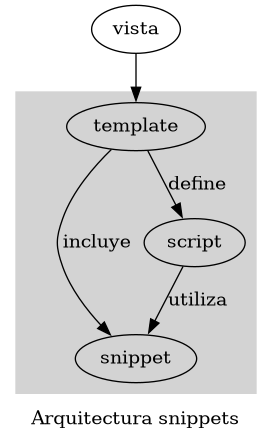
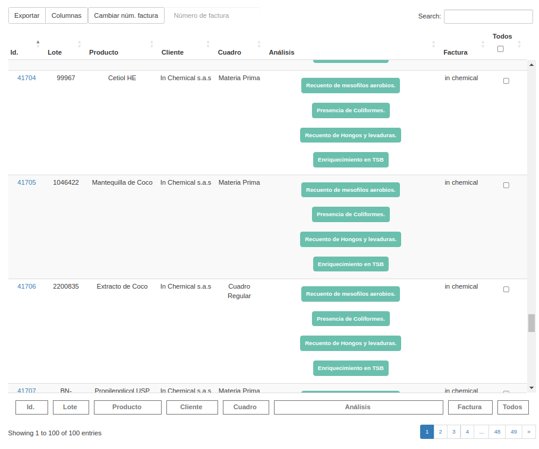
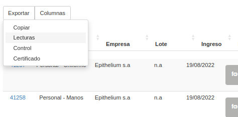

Integración con Datatables
##############################

Datatables ofrece varias formas de consumir datos.
Se decidió utilizar el DOM como fuente. Esto es:

- toma una tabla HTML valida ya existente en la plantilla
- se utiliza un script para seleccionar ese tabla e inicializar un objeto datatable.

Racional
------------------------------
- Proyecto utiliza tablas constantemente y se require además interactivadad
- Iniciar el objeto datatables y luego configurar el comportamiento de las extensiones es tedioso y repetitivo

Patrones
------------------------------

- Se inyecta código en las plantillas a través de snippets

Advertencias
------------------------------
- hay dependencias implicitas entre los métodos de los snippets y las librerias necesarias 
- depende de Datatables y su extensión Buttons `ver aqui <https://datatables.net/extensions/buttons>`_

Diseño
------------------------------

.. image:: ./diagramas/build/secuencia-inicializacion.dot.png

Solución
------------------------------
Cargar el snippet `datatables.html` y utilizar las
funciones de ayuda. Un ejemplo sería esto:

.. code-block:: js

	// importo el snippet 
	
	poner_inputs_en_footer('#muestra-maestra-list');
	// inicializo datatables
	var datatable = init_datatable('#muestra-maestra-list', conf_inicial)
	poner_botones_en_elemento(datatable.buttons().container(), '#funcionalidad-tabla')

Capacidad de extension
++++++++++++++++++++++++++++++
Algunas veces se quieren poner botones y conservar
el estilo de datatables.

Para eso se debe hacer override a la configuración del snippet.
De la siguiente manera:

.. code-block:: js
		
	// dentro del <script> 
	var conf_inicial = conf_factory('#muestra-maestra-list'); // patrón facootry
	var botones = [
		{
			extend: 'collection',
			text: 'Exportar',
			attr: { float: 'right' },
			// butones logica de negocio 
			buttons: [{
				extend: 'copy', text: 'Copiar',

			},
				'<li class="dt-button dt-button buttons-copy buttons-html5" tabindex=1> <input  type="submit"   formaction="" value="Lecturas"/></li>',
				'<li class="dt-button buttons-copy buttons-html5"> <input type="submit" formaction=""  value="Control"></li>',
				'<li class="dt-button buttons-copy buttons-html5">   <input type="submit" formaction="" value="Certificado" ></li>'

			],
			// attr: { class: 'btn btn-primary' }
		},
		{
			extend: 'colvis', text: 'Columnas',

			attr: {
				// class: 'btn btn-primary',

			},
			collectionLayout: 'fixed columns'
		}
	]
	conf_inicial.buttons = botones // override
	// inicializo datatables
	var datatable = init_datatable('#muestra-maestra-list', conf_inicial)

**Advertencia: para que los botones inyectados se vean bien, se deben definir los estilos css manualmente.**

Ejemplo
------------------------------
El snippet ayuda a producir tablas así:

Los botones integrados se ven así:

Probelmas comunes
------------------------------

1. Cuando no hay igual número de elementos en una fila, datatables muestra una alerta en runtime

.. image:: ./assets/ejemplo-alerta-columnas.png

   Para evitar poner el footer a mano en el caso vació se recomienta utilizar el custom template
   tag `filas_tbody_vacio`.

.. code:: python

	# dentro de una tabla 
        
	
        
      
        
