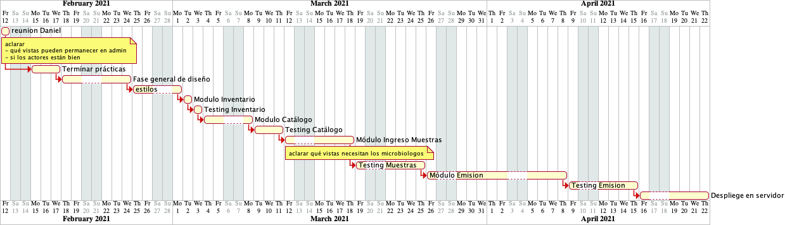
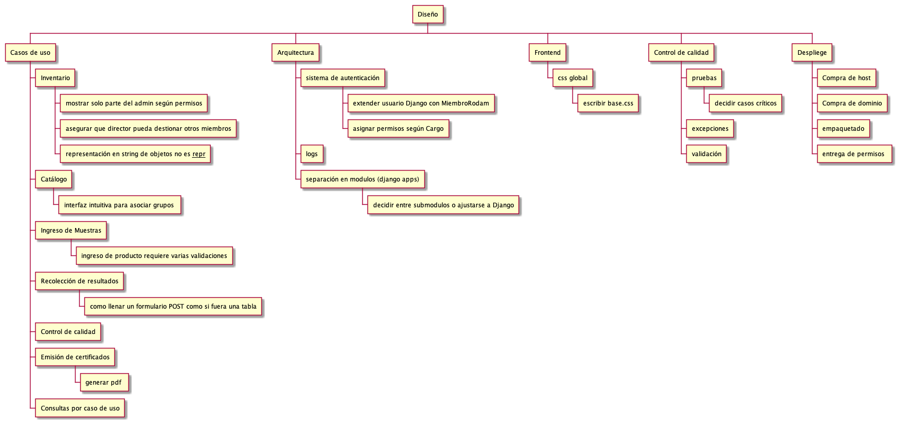

========================
Documento del Proyecto
========================

.. |date| date::

:author: Jonatan Ahumada Fernández
:contact: jaumaf@hotmail.com
:date: 24 de febrero de 2021

       

El objetivo de este documento es resumir y dar trazabilidad al
desarrollo del Sistema de Información de Rodam Análisis.

El sistema documental del laboratorio caracteriza los procesos del
establecimiento de la siguiente manera :

- Proceso de análisis de laboratorio
- Proceso de aseguramiento de la calidad
- Proceso de gestión del cliente
- Proceso de gestión del medio ambiente 

En vista de que la implementación de todo el sistema de información tiene
un alcance considerable. Se optó por segmentar el proyecto en pedazos más
pequeños.

Módulo Laboratorio
==================
Se optó por empezar por el **Módulo Laboratorio**, en vista de que el cliente
priorizaba  la agilización del proceso de análisis del laboratorio. Para mayor
información ver la *Especificación de Requerimientos* para el **Módulo Laboratorio**.

Estimaciones
============

WBS
===

