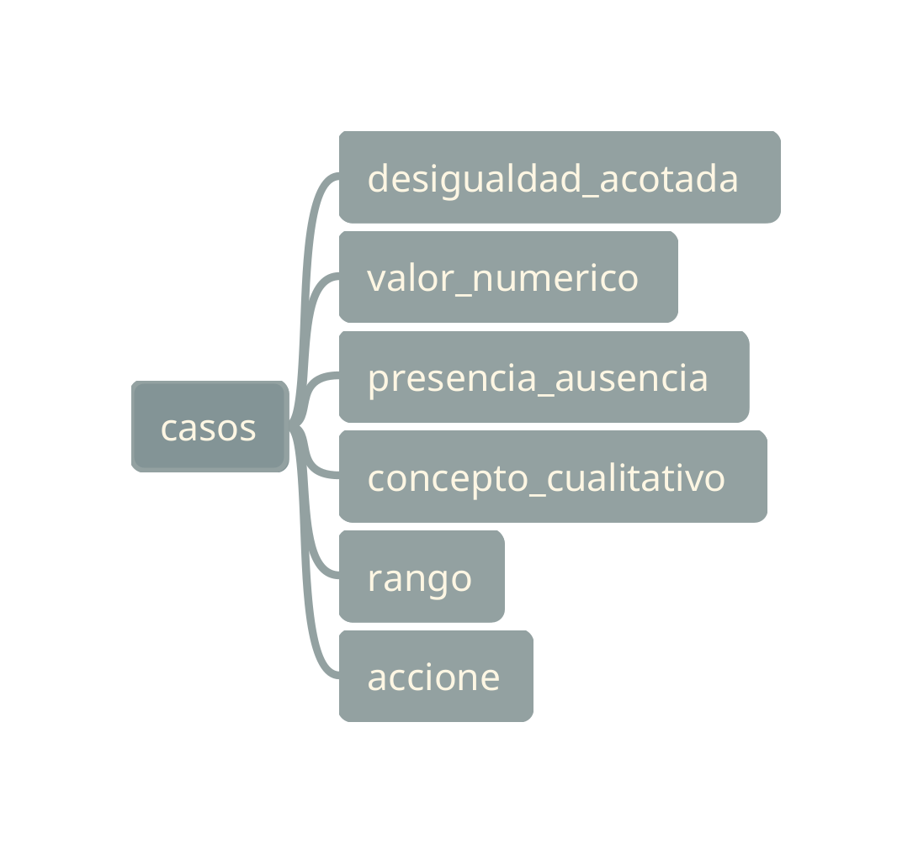

##############################
Casos  LERA
##############################

.. |date| date::
	  
:author: Jonatan Ahumada Fernández
:contact: jaumaf@hotmail.com
:date:  primera version 2023-05-24, último build el |date|

.. contents::

¿Qué es un Caso LERA?
##############################

Es la 'categoría más amplia de reconocimiento'. Cada cadena que
reconoce LERA se clasifica en un caso.

Más técnicamente son las ramas de mayor nivel (más cercanas al nodo principal)
en un 'parse tree'.

Casos principales
######################

	    Casos LERA

¿Dónde se encuentran los casos?
###############################

Los casos se definen como una gramática formal en BNF.
El paquete utilizado como `parser_generator` fue `Lark`_.

.. _Lark: https://lark-parser.readthedocs.io/en/latest/index.html

Un ejemplo del BNF es el siguiente:

.. productionlist::
		caso:  desigualdad_acotada | valor_numerico | presencia_ausencia| concepto_cualitativo | accion
		desigualdad_acotada: desigualdad [magnitud] [unidad_multiple] [dilucion]
		valor_numerico: magnitud [unidad] [dilucion]
		presencia_ausencia: token_presencia_ausencia
		token_presencia_ausencia:  presencia_o_ausencia [SLASH] [valor_numerico]
		concepto_cualitativo: /no detectable|sin clasificar|informativo/i

Aquí solo se  muestran los casos (primer nivel del arbol) y el
segundo nivel. Las reglas utilizadas en el segundo nivel a su vez se
desglosan en más reglas. Para ver todo el BNF ver el `LERA/grammar.py`
en el código fuente.
		

Referencia de casos
#####################

`desigualdad_acotada`
---------------------

Ejemplos
+++++++++
  

.. list-table::
   :header-rows: 1
		 
   * - cadena
     - observacion
   * - < 200 UFC
     - caso más básico
   * - < 200 UFC/g
     - con unidades compuestas o derivadas (SI)
   * - < 2000 UFC/g (1:10)
     - soporta dilucion
      
     

Comportamientos
++++++++++++++++

.. list-table::
   :header-rows: 1
		 
   * - nombre
     - tipo
     - descripcion
     - estado
   * - sugerir unidad (exacta)
     - transformación
     - muestra en ui unidad según especificacion
     - implementado
   * - sugerir unidad (sin derivada)
     - transformación
     - muestra en ui unidad quitándole parte compuesta
     - implementado
   * - sugerir unidad para valor transformado
     - transformación
     - muestra en la ui el valor transformado con la unidad exacta de la especificación
     - implementado
   * - cumple desigualdad (dato primario)
     - validación
     - compara *magnitud* del dato primario con *magnitud* de especificacion y concepto
     - implementado
   * - cumple desigualdad (valor transformado)
     - validación
     - compara *magnitud* del valor transformado con especificacion y concepto
     - implementado
   * - unidad para Petri válida
     - validación
     - revisa si la unidad del dato primario es UFC
     - implementado
   * - tiene unidad (dato transformado)
     - validación
     - revisa si la casilla de dato transformado tiene unidad
     - implementado
   * - unidades coinciden (transformado)
     - validación
     - revisa si la casilla de dato transformado tiene la misma unidad que la especificación
     - implementado
   * - aplicar dilución
     - transformación
     - muestra en la ui la magnitud obtenida si se le aplicara la dilución al dato primario
     - implementado
   * - limite superior
     - transformación
     - transformada 'incontable' a '< 250' si el dato primario no se pude leer en caja de petri
     - implementado
   * - limite inferior
     - transformación
     - muestra en la ui la cadena apropiada para el valor transfomrado si el dato primario es 0
     - implementado
   * - limite inferior (con dilución)
     - transformación
     - aplica dilución y genera la cadena apropiada para el valor transformado si el dato primario es 0
     - implementado
   * - solo valor numérico
     - validacion
     - solo acepta valor numerico o palabra clave incontable
     - pendiente
   * - concepto desigualdad (primario)
     - transformación
     - sugiere el valor del concepto teniendo en cuenta especificacion y dato primario
     - implementado
   * - concepto desigualdad (transformado)
     - transformación
     - sugiere el valor del concepto teniendo en cuenta especifacion y valor transformado
     - implementado
   

`valor_numerico`
---------------------
 
Ejemplos
+++++++++
.. list-table::
   :header-rows: 1
		 
   * - cadena
     - observacion
   * - 100 l
     -  magnitud y unidad
   * - 100 ml
     -  magnitud  unidad con prefijo
   * - 100 ml³
     -  magnitud unidad con pregijo y exponente
   * - 100 ml³ o cm³
     - unidad multiple

Comportamientos
++++++++++++++++

`presencia_ausencia`
---------------------

     
Ejemplos
+++++++++

.. list-table::
   :header-rows: 1
		 
   * - cadena
     - observacion
   * -  presencia
     - caso más básico
   * -  ausencia
     -  caso más basico
   * - PRESENCIA
     - case insensitve
   * - AUSENCIA
     - case insensitve
   * - presencia/100ml
     - con `valor_numerico`
   
      
Comportamientos
++++++++++++++++

.. list-table::
   :header-rows: 1
		 
   * - nombre
     - tipo
     - descripcion
     - estado
   * - concepto presencia ausencia (primario)
     - validacion
     - muestra si la especificacion, el resultado y el concepto son coherentes
     - implementado
   * - concepto presencia ausencia (transformado)
     - validación
     - muestra si la especificacion, el valor transformado y el concepto son coherentes
     - implementado
   * - es presencia ausencia (primario)
     - validacion
     - comprueba que el caso de el dato primario es presencia ausencia
     - implementado
   * - es presencia ausencia (transformado)
     - validación
     - comprueba que el caso de el valor transformado es presencia ausencua
     - implementado
   * - cumple_presencia_ausencia
     - transformación
     - muestra en ui el concepto apropiado según la lectura y especificación
     - implementado
   * - unidad_presencia_ausencia
     - transformación
     - muestra en la ui el valor transformado poniendo el resultado con la unidad de la especificación
     - implementado
   * - presencia ausencia tiene unidad
     - validacion
     - muestra si al resultado transformado le falta una unidad (si está en la especificación)
     - implementado
   * - tiene valor transformado
     - validacion
     - si la especificacion tiene unidad, se requiere un valor transformado
     - implementado
  

`concepto_cualitativo`
----------------------

Ejemplos
+++++++++

.. list-table::
   :header-rows: 1
		 
   * - cadena
     - observacion
   * -  no detectable
     -  cuando limite superior
   * -  sin clasificar
     -  
   * - informativo
     - 

   

Comportamientos
++++++++++++++++

.. todo::

   falta determinar
   
`accion`
---------------------

Ejemplos
+++++++++

.. todo::

   falta determinar
   
Comportamientos
++++++++++++++++

.. todo::

   falta determinar
