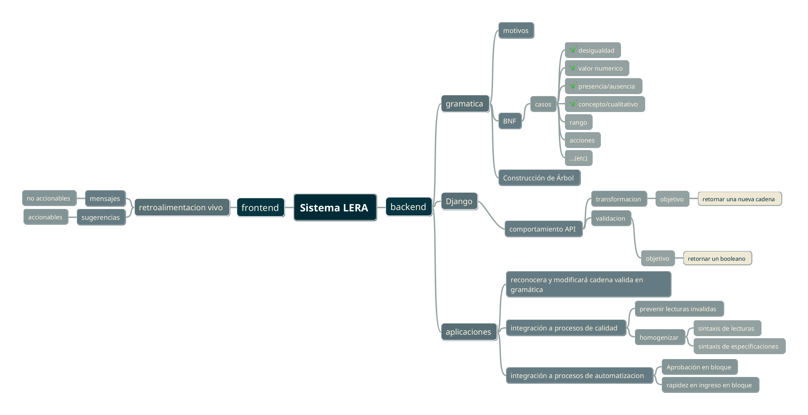

##############################
Sistema LERA
##############################

.. |date| date::
	  
:author: Jonatan Ahumada Fernández
:contact: jaumaf@hotmail.com
:date:  primera version 2023-05-23, último build el |date|

.. contents::

Descripción general
--------------------

LERA es un componente de software dentro la aplicación web de Rodam
Análisis. Es un acrónimo de 'Lenguaje de Especificación de Rodam
Análisis'. El objetivo de LERA se puede sintetizar de la siguiente
manera: transformar una cadena de texto a un entidad de la lógica de
negocio (por ejemplo, una lectura de muestra o una especificación).

Una descripción menos abstracta es: LERA toma una cadena de texto y,
si la reconoce, la interpreta como un objeto de programación. Para ver
como se utiliza LERA desde la perspectiva de un usuario, ver la entrada
:doc:`/usuario/lera` de la Guía de Usuario.

Necesidad
---------

LERA surge para resolver dos problemas concretos:

1. ¿Cómo puedo incorporar la noción de 'dato primario' a mi sistema?

2. ¿Cómo puedo automatizar el proceso aprobación de la muestra si el concepto
   es asignado por el analista?

Ante estas necesidades, LERA responde de la siguiente manera:

1. Lo único que se sabe es que se necesita almacenar el dato primario en la
   base de datos. *Sin embargo*, el *cómo* garantizar la integridad de ese dato
   primario es realmente el problema.

   Para esto, se deja disponible la casilla de entrada ('input') al usuario y
   la del resultado transformado. 

2. Se resuelve el problema desde diversos frentes:

    2.1 Reconocimiento

    Una cadena de texto por sí misma no brinda suficiente información
    para automatizar procesos. Por eso siempre es necesario el
    concepto del analista, para 'llenar la casilla' correctamente.

    Por otro lado, si se impone demasiada estructura, se añade carga
    al proceso de ingreso de muestra y de catálogo.

    
    Sin embargo, si a las cadenas (las especificaciones) ya existentes
    se convierten en 'algo más detallado', se empiezarán a abrir las
    posibilidades de solución. Ese 'algo más detallado' son los *caso*
    de la gramática de LERA.

    2.2. Asistencia

    Se brindan herramientas al analista para 'llenar las casillas' más fácilmente.
    No se abandona el principio de responsabilidad del analista, pero se optimiza
    la usabilidad, sobre todo la capacidad de ejecutar acciones en bloque. 
    

Dificultades de diseño
-------------------------
1. creación de una 'taxonomía' de especificaciones (se encontraron
   72,000 lecturas hechas). ¿Cómo aseguro que cubro todos los casos?

  *Respuesta*: Probablemente no se puedan cubrir todos los casos
  porque se encontrarían inconsistencias sintacticas en las lecturas
  existentes.  Pero es más importante esto: *no es necesario cubrir
  todos los casos anteriores*, por lo menos no en un principio. Basta
  con asegurar los pocos casos mayor repetición e ir *progresivamente*
  cubriendo los demás.

2. ¿Qué tecnología debo usar para interpretar la cadena?

   *Respuesta*: En un principio se presentaban varias
    posibilidades: a) database first, b) gramatica formal, c) machine
    learning, d) usar libreria especializada (NLTK) , por ejemplo, e)
    solo usar regexes.

    La gramática formal pareció la solución más sencilla, con la ventaja de
    que es posible determinar la sintaxis como se quiere. 
    

Dificultades operacionales
-----------------------------
1. ¿Cómo modifico todos los cuadros (analiticos y abstractos),
   análisis, método, etc. para poner los nuevos atributos (dato
   primario, unidad necesario, unidad admitida caso, etc)?

   *Respuesta*: Se podrían modificar con scripts, pero las
   modificaciones continuas (aun con las \`migrations\` de Django),
   crean una carga adicional a todo el proceso de desarollo.  El más
   desgastante, es que se tienen que llenar retroactivamente atributos
   recién añadidos a modelos viejos. La tarea de llenar estos
   atributos implica análisis e implementación adicionales a las
   funcionalidades en sí.

   La solución óptima es *no modificar* los cuadros analíticos, sino
   extraer *toda la información necesaria* de la cadena de
   especificación y la cadena de lectura*

   
2. ¿Qué pasa si el diseño fracasa, cómo retorno al schema anterior sin
   perder todos los datos ingresados en el interim?

   *Respuesta*: Se podría retornar al schema anterior con scripts,
   pero ya se mencionó lo costoso (y también es riesgoso) que es.

   La solución óptima es *solo modificar el schema* cuando se está
   *seguro* de que se necesita, porque el coste operacional es grande
   para usuario final, el desarrollador y el dueño del negocio. La
   forma de evitar modificar lo que ya está es pasando la lógica nueva
   a un componente (un modelo de django por ejemplo), que cargue con
   esa responsabilidad.

Entorno
----------

Como componente, LERA es una `django app`. Una app de django encapsula
varias responsabilidades: modelos, vistas, etc. Por lo mismo, LERA
se subdivide varios componentes. Aquí se aprecia una distinción básica
entre backend y frontend.

    Diagrama de entorno

En el diagrama anterior se pretende mostrar los aspectos más
relevantes de LERA. Como se ve, las aplicaciones de LERA
son variadas. Uno de los atributos detrás de su diseño fue la
**modularidad**.

Atributos de diseño
-------------------

1. Modularidad

   LERA procura ser modular en varios sentidos. El más evidente es que
   se puede configurar desde el admin en tiempo real.

1. Liviandad

   LERA procura ser 'liviano' porque evita modificaciones continuas a
   la estructura de datos.

2. Progresividad

   Como es modular, LERA puede **ampliarse** (ampliando su API),
   **modificarse** (cambiando sus comportamientos), o **ignorarse** (no
   hay dependecias estrictas en el modelo de datos que impacten la
   operación normal de la aplicación).

   La progresividad de LERA se diseñó para poder experimentar
   continuamente con qué comportamientos son más útiles para los
   analistas, hallar experimentalmente cuáles deben ser 'forzados',
   cuales no, etc. Esto se consideró necesario porque plantear un
   diseño 'upfront' para solucionar la necesidades de negocio probó
   ser de gran dificultad.

  
