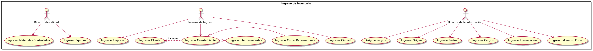
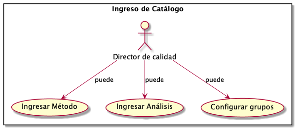
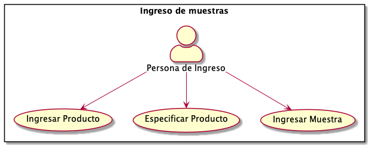
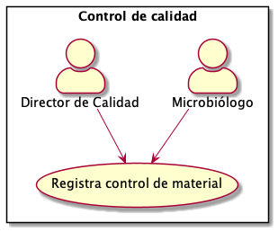
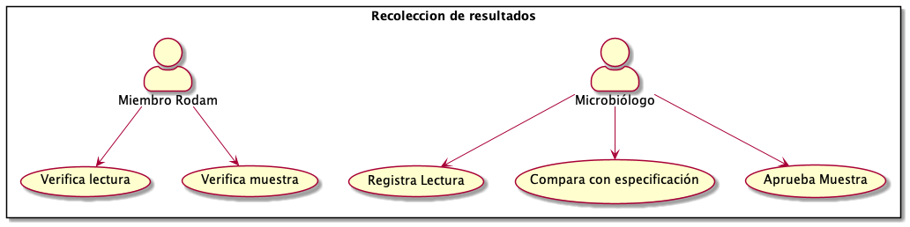
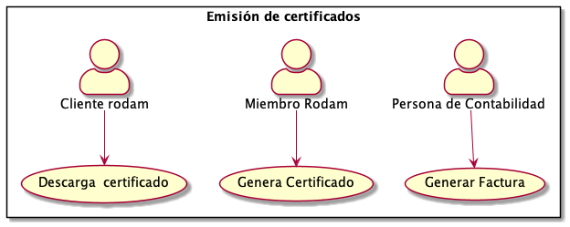
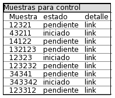
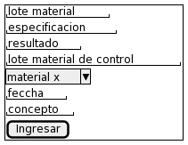

=============================================
Control de Calidad
=============================================

.. |date| date::

:author: Jonatan Ahumada Fernández
:contact: jaumaf@hotmail.com
:date: último build el |date|

Introducción
============

Descripción General
===================

	   

Dependencias secuenciales
-------------------------

Las dependencias secuenciales de los casos de
uso muestran qué funcionalidades dependen de que otras se hayan
ejecutado previamente. Por ejemplo, ingresar un análisis depende de que
haya métodos que agregar en ese análisis.

Esta visualización es útil para diseñar el flujo de eventos de una
interfáz de usuario.

.. image:: ../assets/dependencias_secuenciales.png
   :align: center

Requisitos no funcionales
-------------------------

- portal web debe ceñirse a libro de marca
- la pagina debe ser accesible por los clientes en internet y no presentar demoras de más de 1 minuto al cargar la página
- asegurar la integridad de los datos (backups, logs) regulares por semana. 
- implementar un sistema de roles y permisos (confidencialidad)
- se deben segur las guias de GAMP

  
Requisitos detallados
---------------------

1. autenticar usuario
^^^^^^^^^^^^^^^^^^

Al ingresar a la url del sitio web hay una vista para
autenticarse. No es necesario registrarse a la página
pues el Director de la información se encarga de
ingresar nuevos usuarios.

Una vez el usuario se autentica. Se le muestra un
dashboard. El dashboard mostrará unicamente
las acciones que ese tipo de usuario tiene permitodos.
(Ver casos de uso)

Flujos alternos
+++++++++++++++

1. Si las credenciales son invalidas se deberá redirigir a la pagina de login y el formulario debe
   indicar que se incurrío en un error de validación. Basta con reportar un solo tipo de error (no hay que diferenciar error de usuario o contraseña o permitir registro), ya que
   la responsabilidad recaera en el director de la información de pasar los datos correctamente de  manera interna en el laboratorio. 

2. ingresar muestra
^^^^^^^^^^^^^^^^^^^

La persona de ingreso accede a la url. Se autentica.
Luego, en el dashboard selecciona 'Ingreso de muestras'.

Se le muestra el formulario muestras que consta de los siguientes campos:

- id_origen : combo box seleccionable

- presentacion : combo box seleccionable

- lote_muestra : campo de entrada de texto. Se debe validar siempre un valor numérico

- ingreso_muestra : La fecha del ingreso de la muestra

- descripcion : un text area

- tamano_muestra : campo numero 

- unidades_tamano: campo de texto

  
El usuario diligencia todos y cada uno de los campos.

Flujos alternos
+++++++++++++++

1. Si hay problemas de validación la página redirige a sí misma con
   los datos del POST y las validacioes pertinentes

3. control de los medios
^^^^^^^^^^^^^^^^^^^^^^^

El director de calidad selecciona 'control de los medios' en su dashboard.
Una vista le muestra las muestras que aún no cuentan con un control hecho.
En la lista de muestras hay una columna con un enlace que redirige al formulario
detalle de control de calidad. Cuando se da click, redirige al formulario. Este
consta de los siguientes campos:

- lote_material : textfield. Valida entrada numerica 

- id_material_de_control : Combobox seleccionable que muestra no el id, sino el nombre,

- lote_material_de_control : textfield. Valida entrada numerica

- especificacion :  textfield

- resultado : textfield 

- fecha_resultado : datepicker

- concepto : textarea 

1. Si hay problemas de validación la página redirige a sí misma con
   los datos del POST y las validacioes pertinentes

  

   
