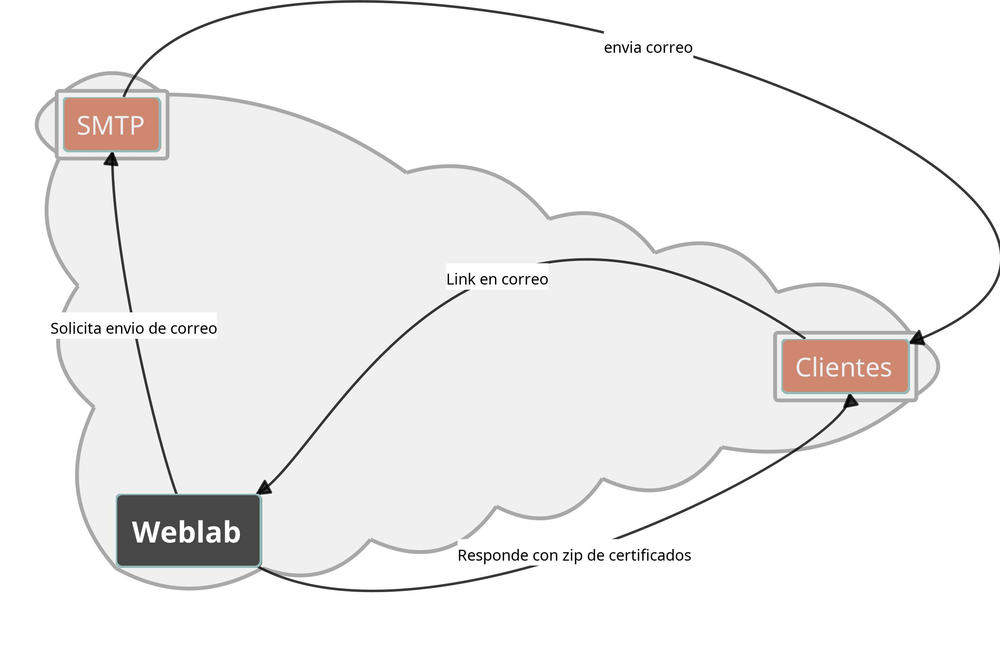

##############################
Envíos de correo
##############################

.. |date| date::
	  
:author: Jonatan Ahumada Fernández
:contact: jaumaf@hotmail.com
:date:  primera version 2023-09-27, último build el |date|

Objetivos del documento
------------------------

Este documento busca describir a rasgos generales el funcionamiento
pronosticado para el envío de correos. Al terminar de leer este
documento, se espera que el lector comprenda:

1. el alcance del envío de correo
2. qué dificultades se deben sobrepasar para implementar la funcionalidad
3. cuáles son los posibles riesgos que conlleva esta funcionalidad
4. cuáles son algunas ideas que guiarán su implementación incial

*No* se presentarán descripciónes detalladas de la API o de otras
definiciones ni se presentarán ejemplos. En caso de necesitarse más
adelante, los documentos relacionados deberán vincularse a este
documento.

Descripción general
--------------------

El envío de correo permitirá al sistema enviar correos a un cliente
elegido.  El correo que se enviará contendrá *todas* las muestras con
estatus *sin enviar*.  Además, la funcionalidad debe proveer una
'plantilla' para el mensaje que se enviará para que el usuario no
redacte constantemente lo mismo, al tiempo que debe permitir
modificaciones para algún cambio puntual.

El correo enviado debe contener principalmente dos cosas: 1) un
resumen de las muestras enviadas y 2) un medio para descargar el
certificado de las muestras.

El objetivo a largo plazo de esta funcionalidad es generar un base de
código que permite programar los envios según un horario estipulado
por el usuario.

Necesidad
---------

Esta funcionalidad busca solucionar las siguientes problemas en concreto:

1. El coordinador actualmente envia los correos de manera manual. Lo que
   implica varias cosas, descritas en los puntos siguientes

2. que el *resumen* dentro del mensaje se genera por intermedio de un
   proceso de Excel en el que se copia la información mostrada en las
   tablas dinámicas de la aplicación.

3. que el  usuario   seleccione primero las muestras
   individualmente, lo que puede dar lugar a error.

4. que, actualmente, no se dispone de una forma para verificar que el
   cliente del laboratorio haya recibido el certificado. Solo se
   registra el momento en que el usuario (el Coordinador en este caso)
   'descarga en bloque' los certificados para incluirlos en un
   correo. Es decir, se puede descargar los certificdos y por
   accidente, jamás enviarlos.

  
Estas necesidades se soucionarán  de la siguiente manera:

1. Todos los pasos de este proceso se reduciran a una sola acción,
   'Enviar Correo'.

2. El *resumen* se podrá generará automaticamte, sin intermedio
   de copiado y pegado entre aplicaciones.

3. El conjunto de muestras será visible desde una vista en donde se
   resuman todas las muestras pendientes de envio discriminadas por
   cliente. Además servirá para obtener una vista rápida del estátus
   de todos los clientes.

4. Se espera que, cuando el cliente reciba el correo, el mensaje
    contenga algún mecanismo (probablemente un link) que simbolice
    el 'recibido' de los certificados. 

Dificultades de diseño
-------------------------

1. No es inmediatamente claro si se deban guardar los correos
   enviados, con el fin de llevar algún tipo de contabilidad
   acerca de los correos. Sin embargo, si se decide guardar
   correos, generará mayor complejidad en la aplicación y
   requerirá mayor diseño. 

2. No es inmediatamente claro cómo implementar el mecanismo
   que accione el 'recibido' de parte del cliente. Teóricamente,
   un link que rediriga a la aplicación debería ser suficiente.
   Pero implementar esto hay que considerar riesgos en la
   seguridad, entre otras cosas (ver Dificultades operacionales)

3. No es inmediatamente claro cómo estructurar la base de datos
   de contacto. Se estima que la estructura actualmente existente
   (los 'representantes de cliente') bastará.

4. Se debe dejar funcionando una forma de verificar que los
   correos se están enviando correctamente (por ejemplo
   un test unitario ejecutable desde consola). 

Dificultades operacionales
-----------------------------

1.  El 'cliente del laboratorio' debe entender que se debe accionar
    'el mecanismo' encontrado dentro del cuerpo del correo. No se le
    enviará un zip con los PDF, como actualmente se hace, sino otro
    tipo de artefacto. Este cambio puede ser confuso para el cliente y
    generar fricción.

2. La integración con un servicio externo, SMTP en este caso, es
   tradicionalmente difícil de asegurar poque el proveedor del
   servicio puede cambiar de API o términos. Puede que esto genere
   tiempo de baja de manera imprevista, aunque no es cómun.

3. El tráfico de red a la aplicación aumentará porque no hay forma de
   impedir que el cliente accione muchas veces el 'mecanismo de
   recibido'. El aumento en tráfico puede generar tarifas adicionales,
   lo que implicará un analisis y monitoreo de las condiciones del
   proveedor de Hosting (Linode, al momento de redactar esto) para
   saber si es sostenible a largo plazo. Esto puede implicar que en un
   futuro se tengan que diseñar e implementar funcionaliad para
   limitar la actividad permitida a los clientes.  (Por ejemplo, que
   el link solo funcione una vez, pero esto a su vez acarreará otros
   problemas).

Entorno
----------

(mostrar cómo se relaciona con otras partes de la aplicación u otro software)

	    Diagrama de entorno

Atributos de diseño
-------------------

.. todo::

   Redactar 

	    
Relacionados
-------------

.. toctree::
   :maxdepth: 2

	   
