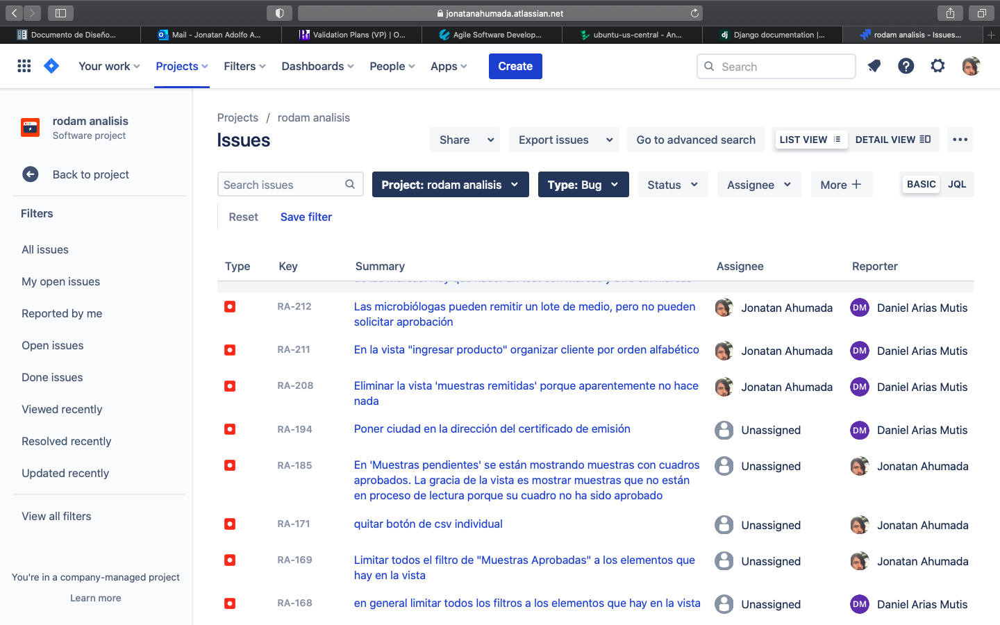

====================
Reporte  de validación
====================

.. |date| date::
	  
:author: Jonatan Ahumada Fernández
:contact: jaumaf@hotmail.com
:date:  último build el |date|

Introducción y alcance
======================

Este documento constituye el reporte de validación para el sistema de
información de Rodam análisis. El propósito de este documento es
explicar cómo se mitigaron los riesgos implicados en el proceso,
identificar los criterios de logro y documentar los hitos más
relevantes durante el proceso.

La estimación de los riesgos más relevantes puede leerse en el *Plan
de Pruebas*. La documentación de los requisitos puede verse en la
*Especificación de Requerimientos*

Descripción del sistema
========================
El sistema de información es una aplicación web para el
ingreso de muestras, la recolección de las lecturas de las muestras
y la emisión de certificados microbiológicos del laboratorio
Rodam Análisis. El sistema es accessible mediante internet
con usuario y contraseña y es desplegado en un entorno de
servidor virtual, del cual Rodam Análisis es dueño. Un
a vista con mayor profundidad puede verse en el *Documento de Diseño*.

Manejo de riesgo
=========================
En esta sección se describirán las acciones de mitigación de riesgos
empleadas para los riesgos identificados.

Riesgo 1:  modelo de datos del sistema es insuficiente y/o genera inconsistencias en los datos
-----------------------------------------------------------------------------------------------
En un sistema de información, más que en un sistema de uso comercial, la integridad de los datos
es crítica. Por tal motivo, desde el inicio del proyecto se llevaron a cabo las siguientes acciones:

- elaboración de una prueba de aceptación que mostrara el flujo de los
  datos a través de la futura aplicación (veáse Prueba de Aceptación)
- normalización de la base de datos hasta tercera forma normal. Esto
  evitará inconsitencias de lectura, escritura y actualización
- pruebas unitarias que muestran el flujo de los datos de la aplicación

Riesgo 2: el artefacto principal, el certificado de emisión, es incompleto
===========================================================================
El objetivo principal del sistema es automatizar el proceso de emisión del certificado, que requiría
mucha labor manual. Para asegurar el cumplimiento de este requerimiento se llevaron a cabo las siguientes acciones:

- se hizo una réplica 1 a 1 del certificado de análisis microbiológico anterior
- se hizo una suite de pruebas automatizadas para revisar el funcionamiento de la emision en cualquier momento

Riesgo 3: el artefacto principal, el certificado de emisión, no es flexible a posteriores cambios
--------------------------------------------------------------------------------------------------

- se diseñó una arquitectura que permite la trazabilidad del certificado y la inclusión de nuevos campos al formulario

  
Riesgo 4:los datos no son accessibles o de difícil interpretación
------------------------------------------------------------------
Otro de los objetivos del sistema era facilitar la obtención de datos de laboratorio de forma estructurada.
Para esto se llevaron a cabo las siguientes acciones:

- diseño de base de datos separa las tablas por áreas funcionales
- se proveyó funcionalidad de exportar datos a formato csv. En algunos casos, los registros son seleccionables de una lista y exportables en bache para posterior procesamiento.
- Se conectó la aplicación PGAdmin al servidor virtual, lo que permite en todo momento hacer consultas a la base de datos

Riesgo 5:  los datos en los formularios no son restringidos de forma adecuada y se permiten ingresar datos erróneos o inconsecuentes
------------------------------------------------------------------------------------------------------------------------------------
- El código de los formularios está separado en módulos. Esto permite inspeccionar su funcionamiento de forma aislada
- existen pruebas unitarias que comprueban que ciertos datos se excluyen o incluyen dependiendo de diversas condiciones (estado del lote, por ejemplo)
- El framework utilizado (Django), tiene soporte incluido para validacion de formularios

Riesgo 6: los requerimientos cambian a medida que se avanaza el desarrollo y se obtiene mayor información sobre las necesidades
---------------------------------------------------------------------------------------------------------------------------------
- en fases tempranas del ciclo de vida hubo una etapa de análisis, donde se propuso el modelo de datos.
- con el avanze del proyecto, se empezó a trabajar en  un marco ágil dónde se registraban las tareas en un /issue tracker/ (Jira)
- las reuniones de seguimiento fueron semanales y constante
- cuando se hizo el primer despliegue se adoptó un marco de CD (continuos delivery), lo que permitía ver actualizaciones de forma muy rápida 

Riesgo 7: cambiar los procesos de negocio que antiguamente se hacían con hojas de cálculo puede dar lugar a confusiones
-------------------------------------------------------------------------------------------------------------------------
- El proceso de migración fue gradual
- se proveyeron scripts de SQL para exportar csv que emulaban el sistema documental anterior

Riesgo 8: las componentes utilizados, tanto de software como de hardware,  son insuficientes o presentan fallas
-----------------------------------------------------------------------------------------------------------------
- la selección del framework de programación fue lenta y deliberada. Se hicieron prototipos antes de iniciar el desarrollo en el framework final.
- El framework seleccionado (Django) tiene una extensa base de usuario, ampliamente documentado y probado. Es reconocido por su filosofía de diseño y confiabilidad. 
- Se hizo una prueba inicial del proveedor del Servidor Virtual (IaaS) desde el 6 de Junio de 2021, antes de iniciar la primera operación el 9 de septiembre de 2021

Riesgo 9: la interfaz gráfica no es inmediatamente comprensible o estéticamente desactualizada
------------------------------------------------------------------------------------------------
- la arquitectura del software permite cambiar la hoja de estilos
- el lenguaje de plantillas de Django permitirá alterar estructura visible de la aplicación con relativa facilidad en un futuro

Estrategia de validación
========================

La estrategia de validación consiste en 2 criterios. Si la
funcionalidad se enmarca dentro de algún el componente con un nivel de
riesgo alto, debe tener una prueba unitaria asociada. El segundo
criterio de validación es que reciba aprobación del experto de dominio
en el ambiente de producción. Así, la estrategia de validación sigue
metodología SCRUM y hace uso de tarjetas o incidencias en un
tablero. Si hay problemas con alguna funcionalidad, se reporta y se
incluye dentro de un sprint.

Un ejemplo de un tablero de incidencias es el siguiente:

Entregables
===========
- Acceso al repositorio de código y documentación
- aplicación desplegada en servidor virtual
- adecuación del servidor virtual para backups y restauración
