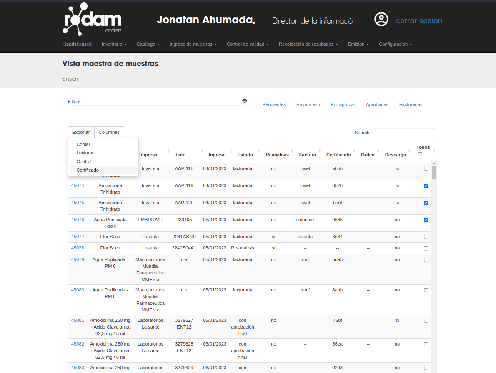

##############################
Descarga de certificados
##############################

Resumen
##############################

La descarga de certificados se puede hacer:

1. desde el Detalle de la Muestra
2. desde la pagina Maestra de muestras a través de: exportar > certificado

Observaciones
--------------
- Cuando un usuario descarga la muestra, se marca automaticamente el atributo `miembro_descargo` como verdadero

Exportación en bloque 
##############################
.. list-table:: Resumen
   :header-rows: 0

   * - Area
     - Emisión
   * - Permisos
     - --
   * - Grupos
     - --
   * - Visibilidad
     - 'Director de la información, 'Director de calidad',
       
Cuando se utiliza la acción exportar > certificado, la aplicación hará lo siguiente:

- tomara el último certificado emitido de cada muestra seleccionada en la tabla, si este existe 
- generará el pdf para cada certificado existente
- comprimirá cada  pdf en un un solo archivo zip
- marcará automáticamente el atributo `miembro_descargo` como verdadadero para cada muestra con certificado existente.

