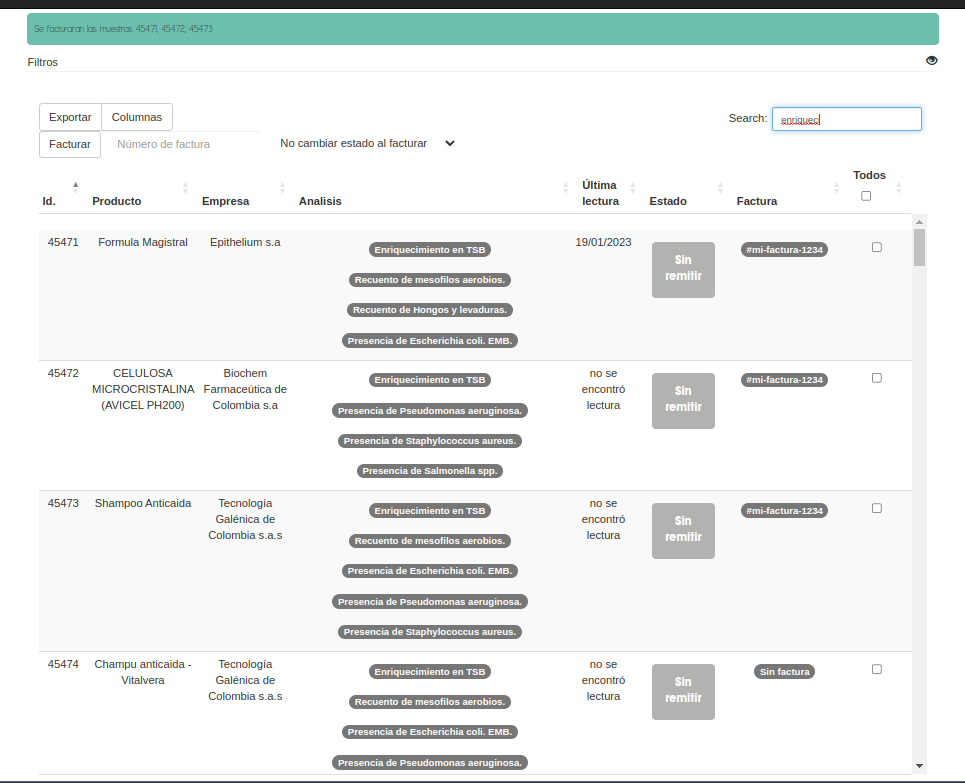

##############################
Facturación
##############################

Muestras Aprobadas
##############################

.. list-table:: Resumen
   :header-rows: 0

   * - Area
     - Emisión
   * - Permisos
     - --
   * - Grupos
     - --
   * - Visibilidad
     - 'Director de la información, 'Director de calidad', 'Asesor Contable'

En esta vista se consultan las muestras que recién fueron aprobadas
por el Director del laboratorio (o usuario con permisos equivalentes),
y por consiguiente tienen estado 'Con Aprobación Final'.

El objetivo de esta vista es reunir estas muestras de modo que fácilmente
se les puede asignar un número de factura.

Al presionar el botón 'Facturar', se le asigna un número de factura y las
muestras seleccionadas cambian su estado a 'Facturada'.

Suposiciones
______________________________

- la mayoría de las muestras se facturan luego de ser aprobadas
- una vez se le asigna un número de factura la muestra cambia de estado

Preguntas
______________________________
- ¿Qué pasa si deseo cambiar el numero de factura? R. Se hace desde la vista 'Muestras Facturadas' o 'Facturación Maestra'
  

     

Facturación Maestra
##############################

.. list-table:: Resumen
   :header-rows: 0

   * - Area
     - Emision
   * -  Permisos
     - `muestra.facturar_desde_maestra`, `muestra.orden_de_compra_asignar`
   * - Grupos
     - 'Asesor Contable'
   * - Visibilidad
     -  'Director de la información', 'Asesor Contable'

En esta vista el usuario puede consultar una lista de todas las
muestras del laboratorio, exceptuando las muestras archivadas.

Desde la tabla interactiva, el usuario puede filtrar dinámicamente
utilizando la barra de búsqueda dinamica o los *controles dedicados*
para columnas.

Luego puede seleccionar las muestras y asignar un número de factura
(alphanumérico) utilizando las *acciones de la tabla*.

Este es un ejemplo en donde se seleccionan muestras que contienen
enrequicimiento y para luego ser facturadas.

.. image::  ./assets/facturacion-maestra-ejemplo-uso.png
   :align: center

Luego de presionar el boton en las *acciones* de la tabla, se obtendrá
un resultado similar a este:

Similarmente, el usuario tambien podrá asginar una orden de compra
a las muestras seleccionadas.

 

