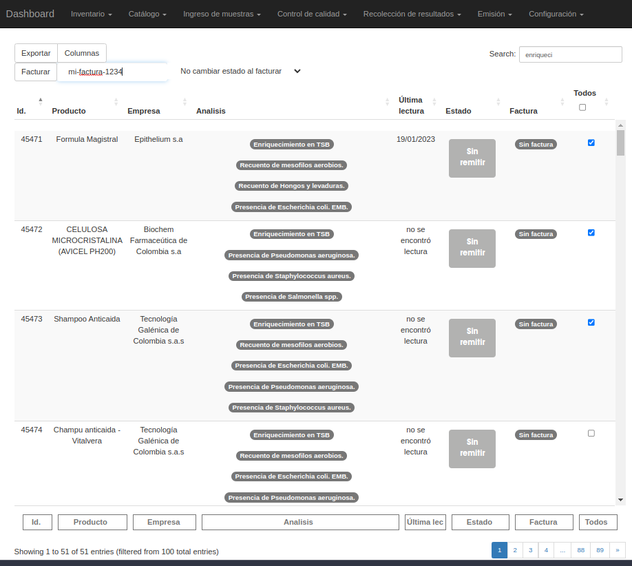

##############################
Facturación
##############################

Facturación Maestra
##############################

.. list-table:: Resumen
   :header-rows: 0

   * - Area
     - Emision
   * -  Permisos
     - `muestra.facturar_desde_maestra`
   * - Grupos
     - 'Asesor Contable'
   * - Visibilidad
     -  'Director de la información', 'Asesor Contable'

En esta vista el usuario puede consultar una lista de todas las
muestras del laboratorio, exceptuando las muestras archivadas.

Desde la tabla interactiva, el usuario puede filtrar dinámicamente
utilizando la barra de búsqueda dinamica o los *controles dedicados*
para columnas.

Luego puede seleccionar las muestras y asignar un número de factura
(alphanumérico) utilizando las *acciones de la tabla*.

Este es un ejemplo en donde se seleccionan muestras que contienen
enrequicimiento y para luego ser facturadas.

Luego de presionar el boton en las *acciones* de la tabla, se obtendrá
un resultado similar a este:

.. image:: ./assets/facturacion-maestra-ejemplo-resultado.png

.. note::
   El comportamiento por defecto de esta vista es no cambiar el
   estado de las muestras. Notése que la muestras afectadas retuvieron
   su estado "Sin remitir".

Cambiar el estado de las muestras
###################################

Si se desea que cuando se facture, se cambie el estado, se debe
habilitar seleccionar primero este comportamiento desde el dropdown.

Ahora, si se realiza la acción facturar las muestras cambiaran a estado
facturado independientemente de su estado anterior. Por esto mismo,
la operación debe realizarse con mucho cuidado.

Un ejemplo del resultado seria parecido a este, nótese que su estado
cambió:

.. warning::
   Si una muestra pasa de su estado "Sin remitir" a "Facturado"
   no pasará por su ciclo de vida normal. Un usuario autorizado
   deberá alterar su estado manualmente para restaurarlo.

 

