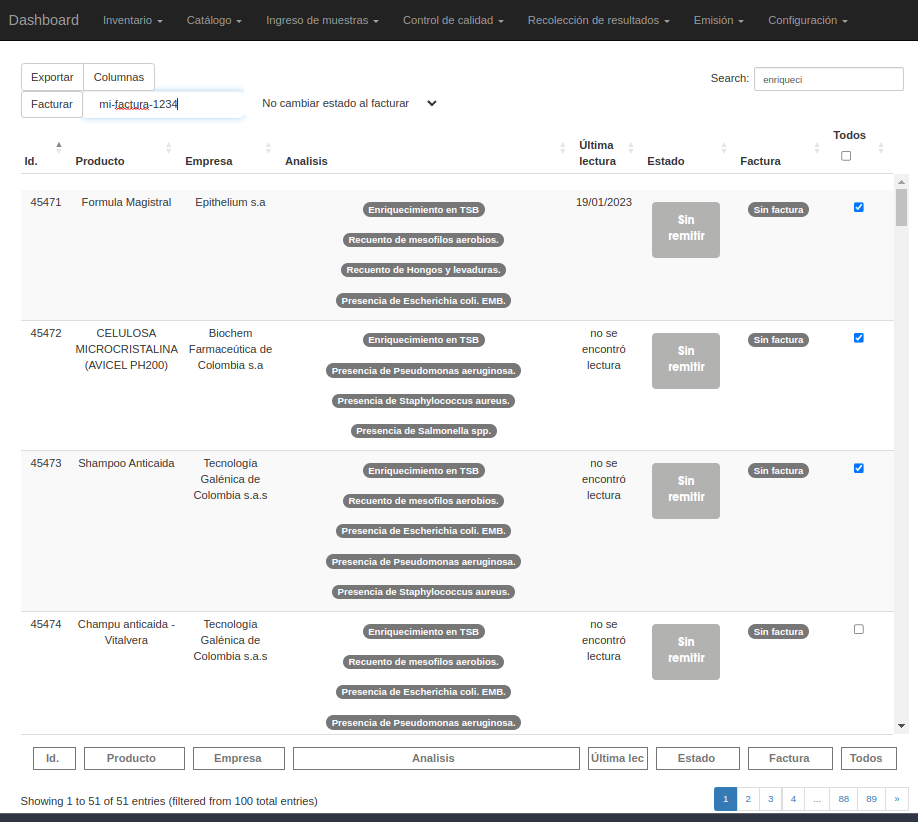
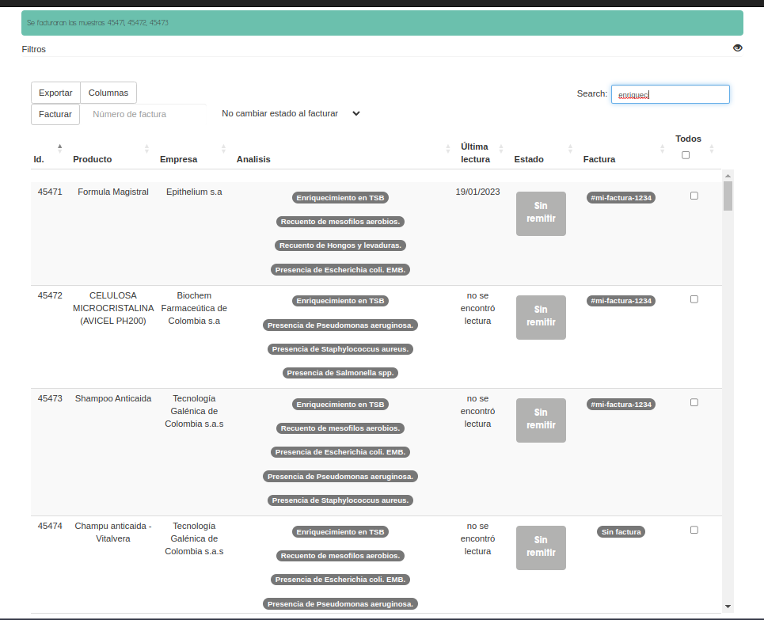

##############################
Facturar una muestra
##############################

.. list-table:: Resumen
   :header-rows: 0

   * - Area
     - Emision
   * -  Permisos
     - `muestra.facturar_desde_maestra`,
   * - Grupos
     - 'Asesor Contable'

Con esta acción el usuario le asigna un número de factura a la muestra.

Efectos secundarios
------------------------------
- Se asigna el valor del formulario al atributo factura
- Si ya existe, se reemplaza
- Se hace auditoría automática de la muestra

Interfaces
-----------------------------
- desde tablas interactivas con el control facturar
  

Ejemplos
---------------------------

Este es un ejemplo en donde se seleccionan muestras que contienen
enrequicimiento y para luego ser facturadas.

Luego de presionar el boton en las *acciones* de la tabla, se obtendrá
un resultado similar a este:

Similarmente, el usuario tambien podrá asginar una orden de compra
a las muestras seleccionadas.

 

