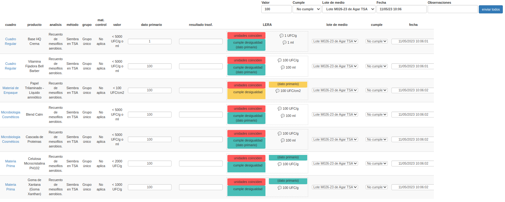
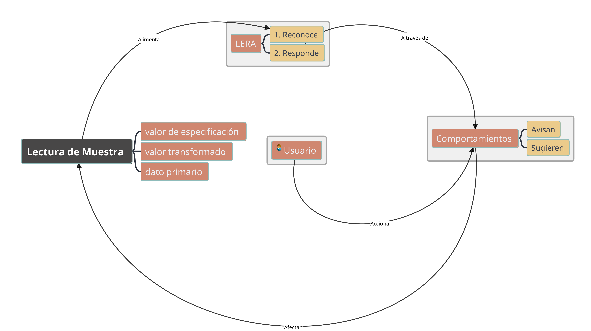
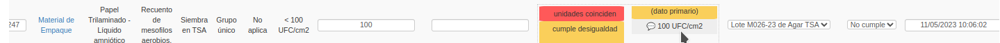
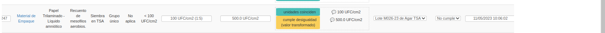
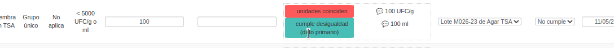
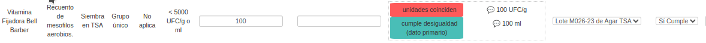
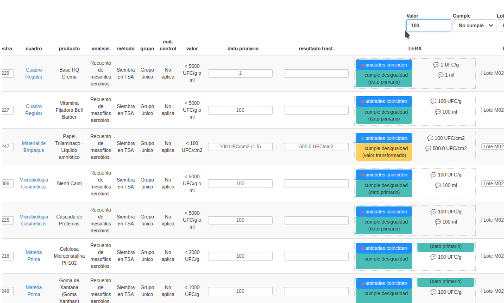
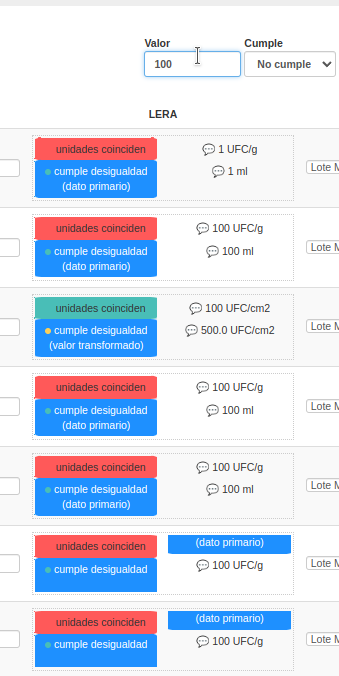
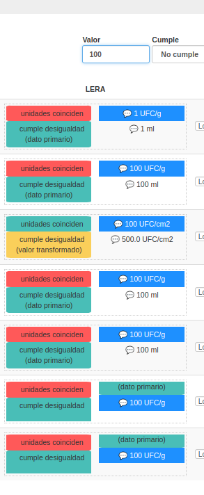
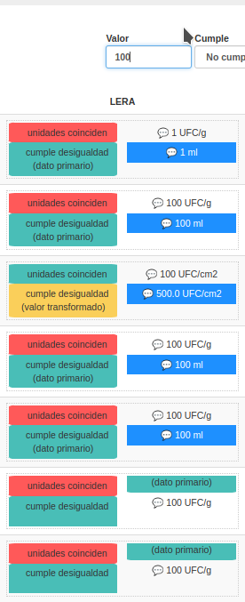

##############################
Sistema LERA
##############################

.. |date| date::
	  
:author: Jonatan Ahumada Fernández
:contact: jaumaf@hotmail.com
:date:  último build el |date|

Resumen
##############################

*LERA* es un acrónimo para *Lenguaje de Especificación de Rodam Análisis*.
Desde el punto de vista del analista, es un sistema que  brinda *asistencia interactiva*
durante el proceso de *recolección de resultados*.

¿Qué hace LERA?
##############################

Al momento de ingresar datos para una lectura de muestra, *LERA* proporciona una serie
de ayudas al microbiólogo. Estas ayudas se presentan en la UI como bloques dentro la
columna 'LERA', para cada formulario de lectura. Estos bloques se llaman *comportamientos*
y pueden ser *accionados* por el usuario.

En esta figura se aprecia el la retroalimentación para varias
lecturas.

	    
   Comportamientos aparecen como rectángulos

El resultado del *accionar* un comportamiento es modificar algún
atributo de la lectura (el dato primario, el dato transformado, el
concepto) de manera automática antes de ingresarlo a la base de datos,
para ahorrar tiempo y evitar errores del ingreso manual. Para accionar un comportamiento,
ver :ref:`Sobre la activación de comportamientos`.

. Algunos ejemplos *concretos* de comportamientos se mostrarán más
adelante en :ref:`¿Qué es la interactividad?`. Las *posibilidades* de
un comportamiento son flexibles y variadas, pero no se discutirán en
este documento.

Cada retroalimentación es individual para la lectura y tiene en cuenta
lo escrito en la especificación y lo escrito en el dato primario.

Aquí se aprecia cómo funciona el sistema LERA desde un punto de vista general.

   Entorno del sistema LERA

Se debe notar que:

- el usuario se encuentra en el centro del sistema
- las respuestas de LERA deben ser accionadas. Por eso el sistema es *interactivo*
- LERA se alimenta de la especificación, de la cadena literalmente escrita, no dependende
  del método ni del análisis. 

¿Qué es la interactividad?
##############################

La interactividad hace referencia al hecho de que el usuario es quien
elige *qué comportamientos* de LERA activar y en *qué orden*.

Primero, veamos un ejemplo de las *acciones* que puede desempeñar
*LERA* cuando el usuario activa alguno de sus comportamientos.

Acciones para modificar el dato primario
-----------------------------------------

En este caso, el activar la acción mediante un click sobre el
comportamiento, el valor escrito en el dato primario cambia.  En este
caso particular, se trataba de una sugerencia para poner la unidad en
el dato primario.

   El puntero se posiciona encima del comportamiento

   Luego de accionarlo el dato primario se modifica automáticamente. Notar la diferencia
   con las otras filas donde no se accionó

Acciones para producir el valor transformado del dato primario
---------------------------------------------------------------

En este caso, al poner en el dato primario la sintaxis para dilución
(X:Y), aparece un comportamiento que le suguiere al usuario el cálculo
de la dilución. Al activarlo mediante un click sobre el comportamiento,
lo escrito en el valor transformado se modifica y se asigna el cálculo
de la dilución sugerido por LERA.

   El comportamiento para aplicar dilución se visibiliza cuando se detecta la sintaxis adecuada

.. warning::

   La sintaxis de dilución siempre va después del valor numérico (magnitud y unidad).
   

   El resultado transformado es generado automáticamente a partir de la acción

Acciones que asignan el concepto de la muestra
-----------------------------------------------

En este caso, vemos que al activar el comportamiento mediante un click,
el concepto de la lectura automáticamente cambia, según el cálculo
de la desigualdad. Esto es, es evalúa " : 100 < 5000".

   El puntero acciona el comportamiento cumple desigualdad
	   

   El comportamiendo modifica el concepto de lectura a 'Sí Cumple'

Sobre la activación de comportamientos
#########################################

Los comportamientos se pueden activar de dos formas:

1. individual, mediante un click en el elemento
2. mediante control grupal, haciendo uso del teclado

En la sección anterior se examinaron varios ejemplos del control individual.
Aquí se mostrarán ejemplos del control grupal.

El control grupal
---------------------

Cuando se está haciendo uso del control grupal, luego de que el valor
del control grupal es *copiado* a cada una de las filas de las lecturas
individuales, LERA inicia automáticamente reconocimiento y responde.

Tránsito de comportamientos
----------------------------
Si el usuario no sale del foco del control grupal, puede usar las fechas,
para *transitar* entre los distintos comportamientos.

El cursor del comportamiento seleccionado a nivel grupal, se muestra como
un rectángulo azul. 

   Cursor del control grupal aparece al presionar las flechas

   Se transita de un comportamiento al otro
   

   Sigue avanzando el cursor
   

   Se ignoran las filas si quedan por fuera del cursor. 

Nótese que es común que haya número desigual de comportamientos entre las filas.
El tránsito seguirá hasta el número máximo de comportamientos que exista y en caso
de que haya filas con un numero de comportamiento menor, se ignorarán. 

Activación grupal
--------------------

Cuando se está haciendo uso del control grupal, y el cursor está activo sobre un
grupo de comportamientos, se puede *accionar* grupalmente los comportamientos seleccionados,
mediante la *combinación de teclas reservada*: `Control + Enter`.

El accionamiento grupal es equivalente a accionar manualmente el comportamiento uno por uno en cada fila.
El resultado de la acción, por lo tanto, dependerá del comportamiento activado en cada fila.

Problemas encontrados
----------------------

- rendimiento. En el uso del control grupal actualmente se está experimentando una demora en el tiempo
  de respuesta de LERA si el set de lecturas es grande (se estima que > 200 lecturas).

Tipos de comportamientos
##############################

En general existen dos tipos de comportamientos:

1. las validaciones

   Estas se presentan al usuario con un código de colores.

   verde: la validación pasó y/o la acción asociada tiene un efecto positivo.
   Ejemplo: el concepto de la lectura  pasa a "Cumple" porque la desigualdad de un
   recuento se cumple.

   amarillo: la validación no pasó y/o la acción asociada tiene un efecto negativo, pero
   no implica un error. Ejemplo: el concepto de la lectura  pasa a "No Cumple" porque la
   desigualdad de un recuento no se cumple.

   rojo: la validación no pasó y la lectura *no se debería* ingresar bajo esas condiciones.
   Ejemplo: las unidades del dato primario no coinciden con la especificación, por lo tanto
   el usuario debería corregir (ya sea manualmente o haciendo uso de alguna sugerencia) la unidad
   antes de ingresar la lectura.

2. las transformaciones

   Las transformaciones no poseen un código de color, pero se indican visualmente como una burbuja
   de diálogo. Estas son las 'sugerencias' que LERA le brinda al usuario.

   Por lo general, accionar una transformación --valga la redundancia-- 'transforma' el dato primario
   en su valor transformado (por ejemplo, aplicando la dilución o añadiendole una unidad automaticamente). 

Consejos generales de uso
##############################

LERA fue diseñado para *asistir* al usuario en vez de tomar decisiones
por el. El analista sigue siendo el último arbitro del ingreso de
lecturas. Por lo tánto, se debe tener en cuenta lo siguiente:

- Si se escogen lecturas con especificaciones del mismo caso, será más
  fácil usar los controles grupales.

- Los comportamientos son atómicos. Por ejemplo, el comportamiento 'cumple desigualdad' solo
  evalua las magnitudes y no hace ningúna modificacion a las unidades.

- Enfoque progresivo.  Por lo general es mejor partir de los más sencillo, el dato primario,
  y progresivamente accionar los comportamientos. Por ejemplo: magnitud > escoger una unidad > poner
  dilución > evaluar el concepto

  

Preguntas Frecuentes
###########################

- P:¿Qué pasa si no aparece nada en la columna LERA? R: Quiere decir que el reconocimiento falló, y no
  se pudo encasillar la lectura en algun *caso* o simplemente aún no hay comportamientos asociados a ese
  caso (puede que en un futuro se agreguen comportamientos). Cuando esto esto ocurre el proceso de
  recolección de resultados puede seguir adelante, solo que sin las facilidades brindadas por la asistencia.

- P:¿Qué pasa si altero los valores de alguna de las casillas individuales? R: Las casillas del formulario
  siguen siendo editables como si se tratara de cualquier otro formulario. Cuando se detecta un cambio en el
  dato primario, LERA intenta retroalimentar nuevamente, pero está la libertad de ignorarla.

- P:¿Estoy recibiendo retroalimentación falsa, qué debo hacer? R: Lo
  primero es asegurarse de tener claro qué debería hacer cada
  comportamiento (ver atomicidad en consejos generales). Luego, puede
  ser que se modificó un valor manualmente y LERA no lo reconozca.  El
  comportamiento por defecto cuando algo no se reconoce es guardar
  silencio. Así que la página seguirá mostrando la última
  retroalimentación anterior válida. Este caso se está estudiando para
  determinar qué debería suceder. Por último, si todo lo anterior se
  verificó, puede ser un error de programación en el
  comportamiento. Presentar el caso a dirección, preferiblemente con
  pantallazos que muestren el valor del dato primario puesto y la
  retroalimentación errónea. Esto entra como un BUG en el sistema de
  rastreo de incidencias y eventualmente deberá ser arreglado.

- P:Estoy tratando de usar el control grupal y no puedo activar los
  comportamientos grupalmente ¿Qué pasa?. R: Recordar que el control
  grupal ofrece dos posibilidades: 1) copiar el valor a todas las filas (tecla enter)
  y 2) accionar los comportamientos seleccionados mediante el cursor (tecla control + enter).
  Tal vez estés mezclando las 2 acciones porque son parecidas. Otra posibilidad es que se trate
  de varias lecturas y el sistema se tarde en procesar todos las filas al mismo tiempo.
  Eventualmente el sistema se optimizará para remediar estos casos. Una medida paliativa
  para este caso es priorizar por conjuntos de lecturas más pequeños.

  

  
  
  
  
