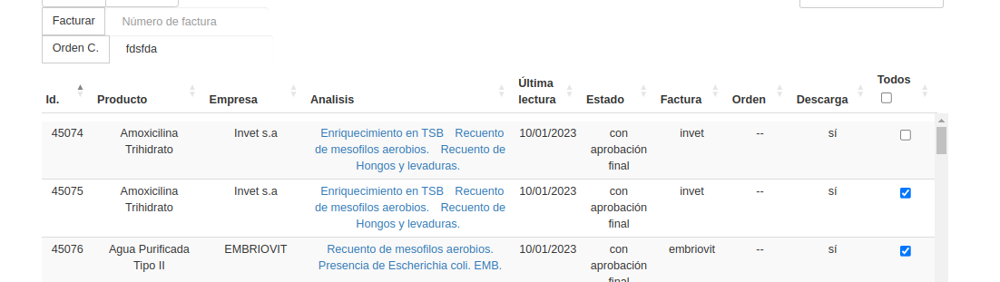

##############################
Asignar orden de compra 
##############################

Resumen
##############################

.. list-table:: Resumen
   :header-rows: 0

   * - Area
     - Emisión
   * - Permisos
     - `ingreso.orden_de_compra_asignar`
   * - Grupos
     - 'Asesor Contable'
	    
La orden de compra es un atributo opcional
de la muestra. Se pide al ingreso de la muestra,
pero luego se puede modificar.

La orden de compra es distinta al número de factura.

Efectos secundarios
##############################
- si se le vuelve a asignar, se reemplaza
- *no* se toma auditoría 

Interfaces
##############################
- Se pide en el proceso de ingreso
- Se puede modificar la orden de compra en la acción 'editar' del detalle de la muestra. Aquí se exige motivo del cambio
- Como acción en bloque  desde alguna vista que tenga habilitada la accíon. Ver :doc:`flujo-emision`.

Ejemplos
###############################

La acción se ve algo similar a esto:

