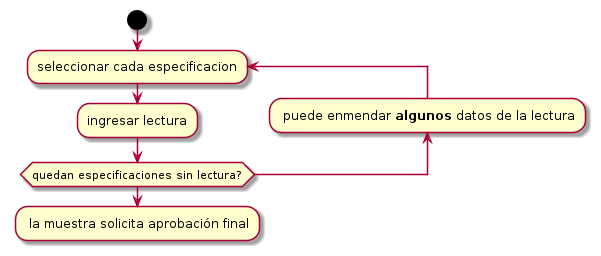
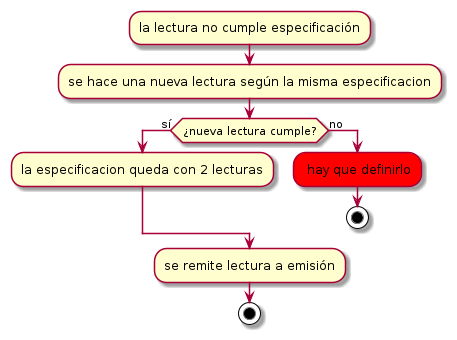
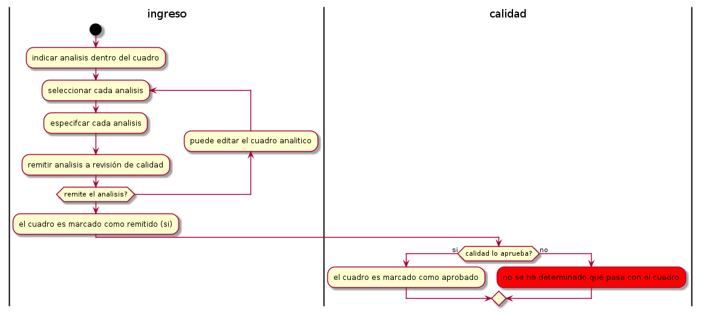
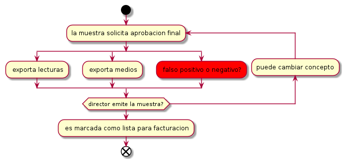

Estado de proyecto
==================
:Author: Jonatan Ahumada <jaumaf@hotmail.com>
:Date: lun 09 ago 2021 

¿Qué cambiará en el pdf?
--------------------------
Necesito saber qué componentes separar:

- el encabezado 
- la versión del formulario
- disclaimer
- bibliografía

¿Lecturas en certificado?
--------------------------

Este es el actual:

.. list-table:: datos visibles al cliente
   :header-rows: 1

   * - metodo
     - analisis
     - medio de cultivo
     - lote de medio
     - especificacion
     - resultado
   * - 
     -
     -
     -
     -
     -
  

Es complicado, porque por interno tenemos
-----------------------------------------

     - id. especificación
     - analisis
     - metodo
     - medio del metodo
     - grupo
     - material de control
     - especificacion
     - id. lectura
     - resultado
     - fecha del resultado
     - responsable del resultado
     - cumple especificaciones
     - lote del medio utilizado
     - observaciones
     - id_producto
     - cuadro analitico
     - origen
     - presentacion
     - lote
     - tamano
     - estado
      

¿Medios en certificado?
-----------------------

- lote
- microorganismo
- atc
- lote cepa
- especificacion
- resultado
- interpretacion del resultado

Otras preguntas del certificado
-------------------------------
- ¿Equipos irán en una lista aparte?
- ¿O en cada lectura?

¿En qué momento se calculan los atributos finales de la muestra?
----------------------------------------------------------------
- fecha de siembra
- fecha de análisis (de aprobación final, última lectura?)
- Muestrado por (es el solicita?)
- Sugiero que sean atributos *débiles* (visibles solo en el cert)

¿En recolección no se decide nada?
----------------------------------

¿Aquí debería decidirse algo de contramuestras?
Ahora solo se remite una vez las espec. están **completas**

¿Si una lectura no cumple?
------------------------------

¿Solo remite, o puede hacer contramuestras?

¿Cabos sueltos? 
---------------

El entendido es que se edita hasta que se aprueba.

	

El flujo de emisión
-------------------------------

¿En este momento se puede retroceder?

Nuevas complejidad
-------------------
- enviar correos periodicamenrte se necestia un nuevo componente
- Celery (Task manager)
- ¿Podemos diferir esto hacia al final?
- en vista del tiempo
  
